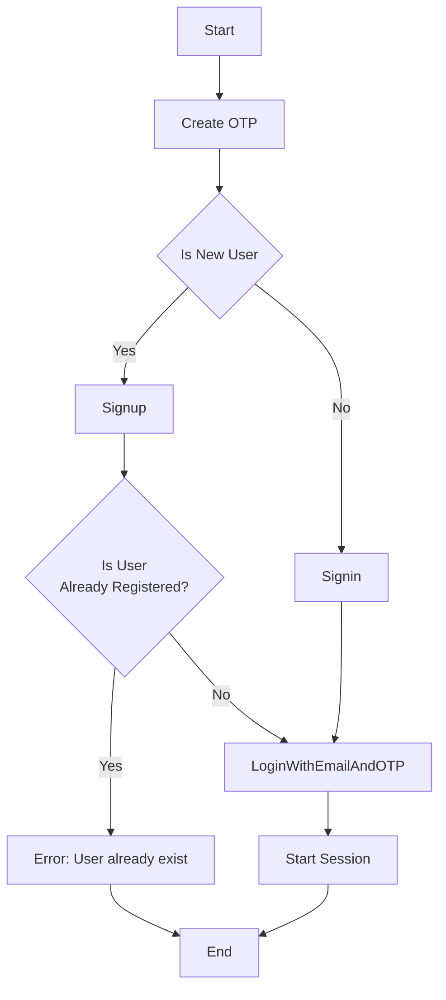

```mermaid
---
Title: Login
---
    flowchart
      Start --> OTP[Create OTP]
      OTP --> IsNewUser{Is New User}
      IsNewUser --> |Yes| Signup[Signup]
      IsNewUser --> |No| Signin[Signin]
      Signup --> IsUserAlreadyRegistered{Is User \n Already Registered?}
      IsUserAlreadyRegistered --> |Yes| ErrorUserAleadyExist[Error: User already exist]
      IsUserAlreadyRegistered --> |No| LoginWithEmailAndOTP
      Signin --> LoginWithEmailAndOTP
      LoginWithEmailAndOTP --> StartSession[Start Session]
      ErrorUserAleadyExist --> End
      StartSession --> End
```